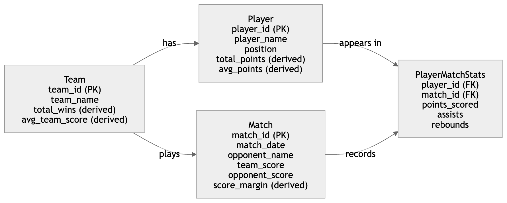
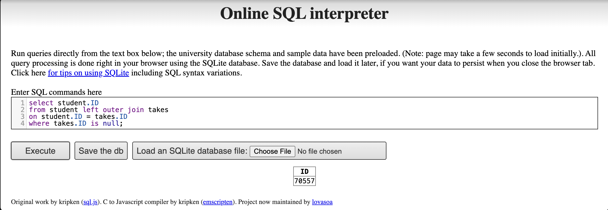

## 1. Difference between a weak and a strong entity set

A **strong entity set** has its own primary key, which means that each entity can be uniquely identified by its own attributes. It exists independently of other entity sets.

A **weak entity set**, in contrast, does not have a complete primary key of its own. It cannot be uniquely identified using only its own attributes. Instead, it must be identified through a combination of its **partial key** and the primary key of a related **strong entity set**. A weak entity also depends on the strong entity for its existence.

### Example

Consider the entities **Building** and **ApartmentUnit**.

-   **Building** is a strong entity set because each building can be uniquely identified by a key such as `building_id`.
-   **ApartmentUnit** is a weak entity set because a unit number such as `101` is not unique by itself. Different buildings may each have a unit `101`.

Therefore, an apartment unit is uniquely identified by combining:

-   `building_id`
-   `unit_no`

In this example, `unit_no` is a **partial key**, and `ApartmentUnit` depends on `Building` for unique identification.

### Summary

The key difference is that a **strong entity set has an independent primary key**, while a **weak entity set must rely on a related strong entity set together with a partial key in order to be uniquely identified**.

## 2. E-R diagram for scoring statistics of a favorite sports team

### 2(a) Favorite sports team

Design idea

To keep track of the scoring statistics of a favorite sports team, the database should store:

the matches played the score in each match the players who appeared in each match each player’s scoring statistics in each match

A suitable E-R design includes the following entities:

Entities

Team

team_id (primary key) team_name total_wins (derived) avg_team_score (derived)

Player

player_id (primary key) player_name position total_points (derived) avg_points (derived)

Match

match_id (primary key) match_date opponent_name team_score opponent_score score_margin (derived)

PlayerMatchStats

player_id (foreign key) match_id (foreign key) points_scored assists rebounds Relationships One Team has many Players One Team plays many Matches One Player can appear in many Matches One Match includes many Players The many-to-many relationship between Player and Match is represented by PlayerMatchStats Derived attributes and how they are computed

For Team

total_wins = count of matches where team_score \> opponent_score avg_team_score = average of team_score across all matches played

For Player

total_points = sum of points_scored across all matches played by the player avg_points = average of points_scored across all matches played by the player

For Match

score_margin = team_score - opponent_score

### Diagram for 2(a)

{width="90%" fig-align="center"}

### 3(a)(i)

(i) Explain why appending natural join section in the from clause would not change the result

Appending natural join section would not change the result because the query already gets all necessary attributes from takes and student. The relation section shares the attributes course_id, sec_id, semester, and year with takes, so the natural join only matches each tuple in takes with the corresponding tuple in section.

However, the query does not use any attributes unique to section, such as building, room_number, or time_slot_id. Therefore, adding natural join section does not affect the select, where, group by, or having clauses, and the final result remains unchanged.

### 3(a)(ii) Test result

First query result:

.png){width="90%" fig-align="center"}

Second query result:

.png){width="90%" fig-align="center"}

### 3(b)

This query uses a left outer join from student to takes on ID. The left outer join keeps all students, including those who do not have any matching row in takes. For students who have never taken a course, the attributes from takes will be NULL. Therefore, the condition where takes.ID is null returns exactly the IDs of students who have never taken a course at the university.

The result of the query in the online SQL interpreter is shown below. {width="90%" fig-align="center"}
