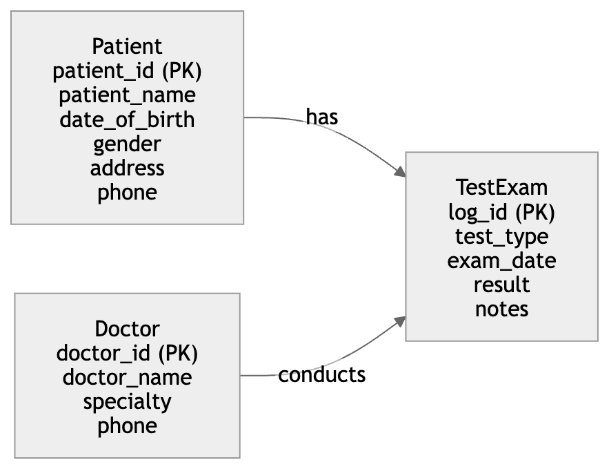
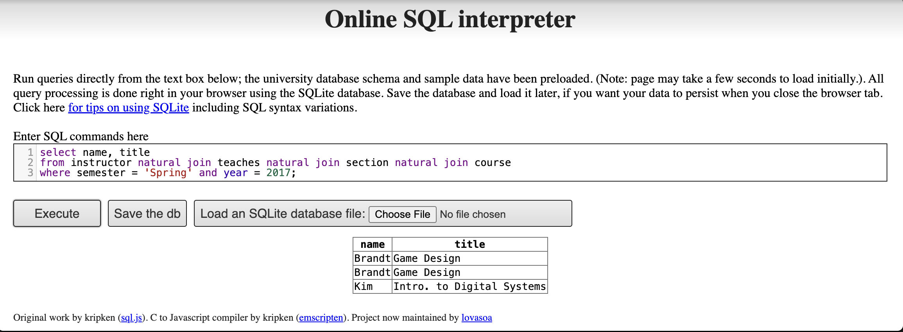

## 2. Construct an E-R diagram for a hospital

To construct an E-R diagram for a hospital, I would include three main
entity sets: **Patient**, **Doctor**, and **TestExam**.

### Entity sets

**Patient** - `patient_id` (primary key) - `patient_name` -
`date_of_birth` - `gender` - `address` - `phone`

**Doctor** - `doctor_id` (primary key) - `doctor_name` - `specialty` -
`phone`

**TestExam** - `log_id` (primary key) - `test_type` - `exam_date` -
`result` - `notes`

### Relationships

-   A **Patient** can have many **TestExam** records.
-   Each **TestExam** record belongs to one **Patient**.
-   A **Doctor** can conduct many **TestExam** records.
-   Each **TestExam** record is conducted or supervised by one
    **Doctor**.

In this design, **TestExam** serves as the log of various tests and
examinations conducted for each patient. It records the type of test or
examination, the date, the result, and notes, while also linking the
record to both the patient and the doctor.

This structure allows the hospital to maintain a complete history of
tests and examinations for each patient.

### Diagram

{width="85%" fig-align="center"}

## 3. Why do we have weak entity sets?

Although any weak entity set can be converted into a strong entity set
by adding appropriate attributes, weak entity sets are still useful
because they represent the real-world meaning of the data more clearly.

A weak entity set is used when an entity does not have an independent
key of its own and depends on another entity for identification.
Modeling such an entity as weak makes this dependency explicit in the
schema.

Weak entity sets are important for several reasons:

1.  **They capture existence dependency.**\
    A weak entity cannot exist without its related strong entity.

2.  **They reflect natural identification.**\
    In many situations, an object is identified only in the context of
    another object. For example, an apartment unit may be identified
    within a building, or a dependent may be identified within an
    employee’s family.

3.  **They improve conceptual clarity.**\
    Even though we could artificially add a new key and make the entity
    strong, doing so may hide the meaningful relationship between the
    entities.

Therefore, we have weak entity sets not because it is impossible to
create strong entity sets, but because weak entity sets provide a more
accurate and meaningful model of the enterprise.

#### 4(a)(i)

Find ID and name of each employee who lives in the same city as the
location of the company for which the employee works.

``` sql
select e.ID, e.person_name
from employee as e, works as w, company as c
where e.ID = w.ID
  and w.company_name = c.company_name
  and e.city = c.city;
```

#### 4(a)(ii)

``` sql
select e.ID, e.person_name
from employee as e, employee as mgr, manages as m
where e.ID = m.ID
  and m.manager_id = mgr.ID
  and e.city = mgr.city
  and e.street = mgr.street;
```

### 4(a)(iii)

``` sql
select e.ID, e.person_name
from employee as e, works as w
where e.ID = w.ID
  and w.salary > (
    select avg(w2.salary)
    from works as w2
    where w2.company_name = w.company_name
  );
```

### 4(b)

{width="85%" fig-align="center"}

### What is wrong with this query?

The query is problematic because it uses natural join. A natural join
matches all attributes with the same name in both relations. In this
schema, both instructor and course contain the attribute dept_name.
Therefore, the final natural join course imposes an unintended condition
on dept_name in addition to the intended join on course_id.

As a result, the query may incorrectly exclude valid tuples whenever an
instructor teaches a course that is not in the same department as the
instructor. Therefore, although the query runs and produces output, its
logic is still incorrect.
