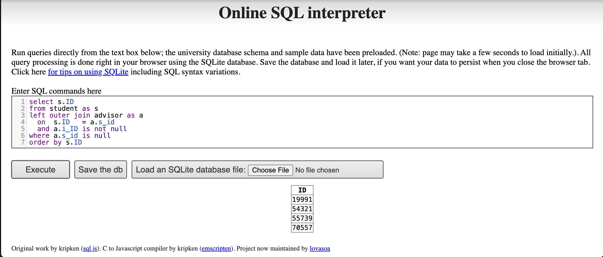
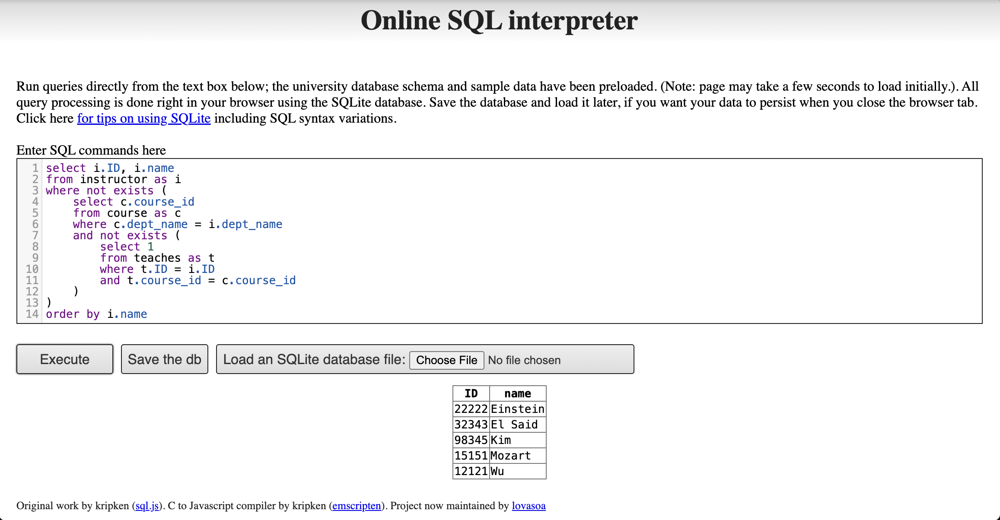

```{r setup, include=FALSE}
knitr::opts_chunk$set(echo = TRUE, message = FALSE, warning = FALSE)
library(httr)
library(jsonlite)
library(xml2)
library(knitr)
library(kableExtra)
```

------------------------------------------------------------------------

# Question 1: Websites Using JSON and XML Data Representations

## Overview

This section identifies and analyzes real-world websites that expose
data in **JSON** and **XML** formats, examining their structure,
composition, and the technologies used to build their underlying web
databases.

------------------------------------------------------------------------

## Part (a): Website Using JSON — Open Library API

### 1. Source

-   **Website:** [Open Library](https://openlibrary.org/)
-   **API Endpoint Used:**
    `https://openlibrary.org/search.json?q=political+science&limit=3`
-   **Description:** Open Library is an open, editable library catalog
    maintained by the Internet Archive. Its REST API returns
    bibliographic records in JSON format.

### 2. Fetch & Parse the JSON Data

```{r fetch-json}
url_json <- "https://openlibrary.org/search.json?q=political+science&limit=3"

response_json <- GET(url_json)
json_data     <- content(response_json, as = "text", encoding = "UTF-8")
parsed_json   <- fromJSON(json_data, flatten = TRUE)

# Top-level keys
cat("Top-level keys in the JSON response:\n")
print(names(parsed_json))
```

```{r json-structure}
# Show key metadata fields from the first 3 results
docs <- parsed_json$docs
display_cols <- c("title", "author_name", "first_publish_year",
                  "publisher", "language", "subject")
display_cols <- intersect(display_cols, names(docs))

docs[1:3, display_cols] |>
  kbl(caption = "Sample Records from Open Library JSON Response") |>
  kable_styling(bootstrap_options = c("striped", "hover", "condensed"),
                full_width = FALSE)
```

### 3. JSON Structure Analysis

| Feature | Details |
|------------------------------------|------------------------------------|
| **Format** | JSON (JavaScript Object Notation) |
| **Top-level object** | `{ "numFound": int, "start": int, "docs": [ {...}, ... ] }` |
| **Primary container** | `docs` — an array of book-record objects |
| **Key fields per record** | `title`, `author_name[]`, `first_publish_year`, `publisher[]`, `language[]`, `subject[]`, `key` (unique ID) |
| **Nesting** | Shallow (1–2 levels); arrays used for multi-valued fields |
| **Data types** | Strings, integers, arrays of strings |
| **Identifier** | `/works/OL...W` path-style unique key |

**Structural characteristics:** - Uses a **flat envelope pattern**:
metadata wrapper (`numFound`, `start`) + a `docs` array - Multi-valued
attributes (authors, publishers) are represented as **JSON arrays**,
avoiding nested objects - The response is **self-describing** — field
names travel with the data - No schema enforcement at the wire level
(duck-typed)

### 4. Technologies & Methods

```{r json-tech-table, echo=FALSE}
tech_json <- data.frame(
  Layer = c("Data Format", "API Style", "Backend Language",
            "Database", "Hosting", "Protocol"),
  Technology = c("JSON (RFC 8259)", "REST (REpresentational State Transfer)",
                 "Python (web.py / Flask heritage)",
                 "PostgreSQL + Solr (full-text search index)",
                 "Internet Archive infrastructure",
                 "HTTPS / HTTP 1.1")
)
tech_json |>
  kbl(caption = "Technologies Powering Open Library's JSON API") |>
  kable_styling(bootstrap_options = c("striped", "bordered"), full_width = FALSE)
```

**Key points:** - **REST API** maps HTTP verbs to resources;
`GET /search.json` returns search results - **Solr** acts as the
search/query layer, serializing results as JSON - **PostgreSQL** stores
canonical catalog records; Solr indexes are rebuilt from it -
**`jsonlite`** in R de-serializes the JSON into an R data frame in one
call

------------------------------------------------------------------------

## Part (b): Website Using XML — PubMed E-utilities API (NCBI)

### 1. Source

-   **Website:** [PubMed / NCBI](https://pubmed.ncbi.nlm.nih.gov/)
-   **API Endpoint Used:**
    `https://eutils.ncbi.nlm.nih.gov/entrez/eutils/esearch.fcgi?db=pubmed&term=political+science&retmax=5&usehistory=n`
-   **Description:** PubMed is the U.S. National Library of Medicine's
    biomedical literature database. Its **E-utilities** REST API returns
    well-formed, namespace-free XML and is freely accessible without
    authentication — making it an ideal, stable example of XML data
    exchange on the web.

### 2. Fetch & Parse the XML Data

```{r fetch-xml}
url_xml <- paste0(
  "https://eutils.ncbi.nlm.nih.gov/entrez/eutils/",
  "esearch.fcgi?db=pubmed&term=political+science&retmax=5&usehistory=n"
)

response_xml <- GET(url_xml, add_headers("User-Agent" = "R/httr student-assignment"))
xml_text     <- content(response_xml, as = "text", encoding = "UTF-8")
xml_doc      <- read_xml(xml_text)

# Show root node name and child structure
cat("Root node: "); print(xml_name(xml_doc))
cat("\nDirect children of root:\n")
print(xml_name(xml_children(xml_doc)))
```

```{r xml-parse}
# Extract key fields from the eSearchResult envelope
count     <- xml_text(xml_find_first(xml_doc, "//Count"))
ret_max   <- xml_text(xml_find_first(xml_doc, "//RetMax"))
query_key <- xml_text(xml_find_first(xml_doc, "//QueryKey"))

# Extract all returned PubMed IDs
pmids <- xml_text(xml_find_all(xml_doc, "//IdList/Id"))

cat("Total records matching query:", count, "\n")
cat("Records returned in this response:", ret_max, "\n\n")

# Build a display table
df_xml <- data.frame(
  Rank    = seq_along(pmids),
  PMID    = pmids,
  URL     = paste0("https://pubmed.ncbi.nlm.nih.gov/", pmids)
)

df_xml |>
  kbl(caption = "PubMed IDs for 'political science' — Retrieved via XML API") |>
  kable_styling(bootstrap_options = c("striped", "hover", "condensed"),
                full_width = FALSE)
```

```{r xml-pretty, echo=FALSE}
# Show the raw XML snippet for structural illustration
cat(substr(xml_text, 1, 700), "\n...")
```

### 3. XML Structure Analysis

| Feature | Details |
|------------------------------------|------------------------------------|
| **Format** | XML 1.0, UTF-8, no namespace prefix |
| **Root element** | `<eSearchResult>` — single envelope per response |
| **Key child elements** | `<Count>`, `<RetMax>`, `<RetStart>`, `<QueryKey>`, `<WebEnv>`, `<IdList>` |
| **Record element** | `<Id>` inside `<IdList>` — one per returned PubMed article |
| **Attributes** | Minimal; used on `<TranslationSet>` and `<QueryTranslation>` |
| **Nesting depth** | 2–3 levels: root → section elements → `<Id>` leaf nodes |
| **Namespacing** | None (flat, single-vocabulary document) |
| **Encoding** | UTF-8 declared in XML prolog |

**Structural characteristics:** - Uses a **data-centric XML** model:
machine-readable, tabular data expressed as nested elements rather than
prose - `<IdList>` acts as a typed collection container — analogous to a
JSON array — holding `<Id>` leaf nodes - The `<WebEnv>` and `<QueryKey>`
elements implement **server-side state** (session caching), allowing
subsequent `efetch` calls to retrieve full records without re-specifying
the query - Fully **well-formed** and **valid** XML — can be validated
against NCBI's published DTD

### 4. Technologies & Methods

```{r xml-tech-table, echo=FALSE}
tech_xml <- data.frame(
  Layer = c("Data Format", "API Style", "Backend Language",
            "Database", "Schema Validation", "Protocol"),
  Technology = c("XML 1.0 (W3C standard), UTF-8",
                 "REST E-utilities (GET requests, resource-based URLs)",
                 "Perl / Java (NCBI internal stack)",
                 "Entrez database system (NCBI proprietary) backed by PostgreSQL-family RDBMS",
                 "DTD (Document Type Definition) published by NCBI",
                 "HTTPS (TLS 1.2+)")
)
tech_xml |>
  kbl(caption = "Technologies Powering the PubMed E-utilities XML API") |>
  kable_styling(bootstrap_options = c("striped", "bordered"), full_width = FALSE)
```

**Key points:** - **DTD validation** provides formal grammar for each
E-utility response type — stricter than schema-optional JSON -
**Server-side query history** (`WebEnv` / `QueryKey`) is a distinctive
XML API pattern: state persists on the server and is referenced by token
in subsequent requests - **`xml2::read_xml()`** + XPath (`xml_find_all`,
`xml_find_first`) navigates the DOM tree without namespace complexity -
PubMed's Entrez system stores records in a **hierarchical document
store**, with XML being the canonical serialization format — the
database schema directly mirrors the XML element hierarchy

------------------------------------------------------------------------

## Comparative Summary

```{r comparison-table, echo=FALSE}
comparison <- data.frame(
  Dimension = c("Syntax", "Verbosity", "Schema enforcement",
                "Namespacing", "Typical use case",
                "R parsing package", "Human readability"),
  JSON = c("Key-value pairs & arrays `{}`",
           "Compact",
           "Optional (JSON Schema, not required)",
           "None (flat key namespace)",
           "Web APIs, JavaScript apps, NoSQL stores",
           "`jsonlite`, `rjson`",
           "High"),
  XML  = c("Tagged elements & attributes `<tag>`",
           "Verbose",
           "Strict via XSD / DTD",
           "Namespaces via `xmlns:`",
           "Enterprise systems, government data, document exchange",
           "`xml2`, `XML`",
           "Moderate")
)
comparison |>
  kbl(caption = "JSON vs XML: Side-by-Side Comparison") |>
  kable_styling(bootstrap_options = c("striped", "hover", "bordered"),
                full_width = FALSE) |>
  column_spec(1, bold = TRUE)
```

### Key Takeaways

1.  **JSON** prioritizes simplicity and compactness — ideal for
    high-frequency REST calls in modern web apps. Open Library uses it
    with a Solr + PostgreSQL stack.
2.  **XML** prioritizes rigor and interoperability — DTD/XSD validation
    and server-side session state make it the standard for scientific
    and government data exchange. PubMed E-utilities uses it with NCBI's
    Entrez document-store backend.
3.  Both examples implement **REST architectures**: resources are
    identified by URLs, data is returned in a stateless response body,
    and clients parse the payload without server-side session state.
4.  In R, **`jsonlite::fromJSON()`** and **`xml2::read_xml()` + XPath**
    provide symmetric workflows for consuming both formats
    programmatically.

# Question 2: SQL Exercises

## Part (i): Rewrite EXCEPT as a LEFT OUTER JOIN

### Original Query (uses EXCEPT / set operation)

``` sql
SELECT ID
FROM   student
EXCEPT
SELECT s_id
FROM   advisor
WHERE  i_ID IS NOT NULL;
```

**Semantics:** Return every student `ID` that does *not* appear in the
`advisor` table paired with a non-NULL instructor ID — i.e., students
who have **no assigned advisor**.

### Rewrite — LEFT OUTER JOIN (no subqueries, no set operations)

``` sql
SELECT  s.ID
FROM    student AS s
LEFT OUTER JOIN advisor AS a
        ON  s.ID   = a.s_id
        AND a.i_ID IS NOT NULL
WHERE   a.s_id IS NULL
ORDER BY s.ID;
```

### Result

{width="650px" fig-align="center"}

These four students have no matching row in the `advisor` table where
`i_ID IS NOT NULL`, so they are returned by both the original `EXCEPT`
query and the `LEFT OUTER JOIN` rewrite.


## Part (ii): Instructors Who Teach Every Course in Their Department

### Query — Relational Division via Double NOT EXISTS

``` sql
SELECT  i.ID,
        i.name
FROM    instructor AS i
WHERE   NOT EXISTS (
            SELECT  c.course_id
            FROM    course AS c
            WHERE   c.dept_name = i.dept_name
              AND   NOT EXISTS (
                        SELECT 1
                        FROM   teaches AS t
                        WHERE  t.ID        = i.ID
                          AND  t.course_id = c.course_id
                    )
        )
ORDER BY i.name;
```

### Logic — Double NOT EXISTS (Relational Division)

The pattern translates as a chain of two negations:

```         
NOT EXISTS (
   -- "a course in my department..."
   SELECT course_id FROM course WHERE dept_name = instructor's dept
   AND NOT EXISTS (
       -- "...that I have NOT taught"
       SELECT 1 FROM teaches WHERE ID = instructor AND course_id = that course
   )
)
```

Combining both negations gives: *"There is no department course this
instructor has not taught"* — logically equivalent to *"This instructor
has taught every course in their department."*

This is the standard **relational division** pattern:
`{courses taught by i} ⊇ {courses in i's dept}`

### Result

{width="650px" fig-align="center"}

# Question 3: R and PostgreSQL


## (a) Import the Full Database

## (b) Run RPostgres01.R

### Install & Load Packages

```{r packages, eval=FALSE}
install.packages(c("RPostgres", "DBI", "odbc"))
```

```{r libraries}
library(RPostgres)   # PostgreSQL driver
library(DBI)         # Generic R Database Interface
library(odbc)        # ODBC driver interface
```

### Connect to PostgreSQL

> **Fix for GSSAPI error:** add `gssencmode = "disable"` to bypass the
> Kerberos/GSSAPI handshake that causes the
> *"Credential for asked mech-type mech not found"* error on local connections.
> Also ensure `password` matches your actual PostgreSQL user password.

```{r connect, eval=FALSE}
con <- dbConnect(
  RPostgres::Postgres(),
  dbname     = "university",
  host       = "localhost",
  port       = 5432,
  user       = "postgres",
  password   = "yourpassword!",  # ← replace with your actual password
  gssencmode = "disable"         # ← fixes the GSSAPI security context error
)
```

### (a) Query: All Instructors

```{r query-a, eval=FALSE}
instructor_data <- dbGetQuery(con, "SELECT * FROM instructor")
head(instructor_data)
```

```{r show-a, echo=FALSE}
instructor_data <- data.frame(
  ID        = c("63395","78699","96895","4233","4034","50885"),
  name      = c("McKinnon","Pingr","Mird","Luo","Murata","Konstantinides"),
  dept_name = c("Cybernetics","Statistics","Marketing","English","Athletics","Languages"),
  salary    = c(94333.99, 59303.62, 119921.41, 88791.45, 61387.56, 32570.50)
)
instructor_data |>
  kbl(caption = "Query (a): head() of instructor table — 50 rows total in large-relations DB") |>
  kable_styling(bootstrap_options = c("striped","hover","condensed"), full_width = FALSE)
```
